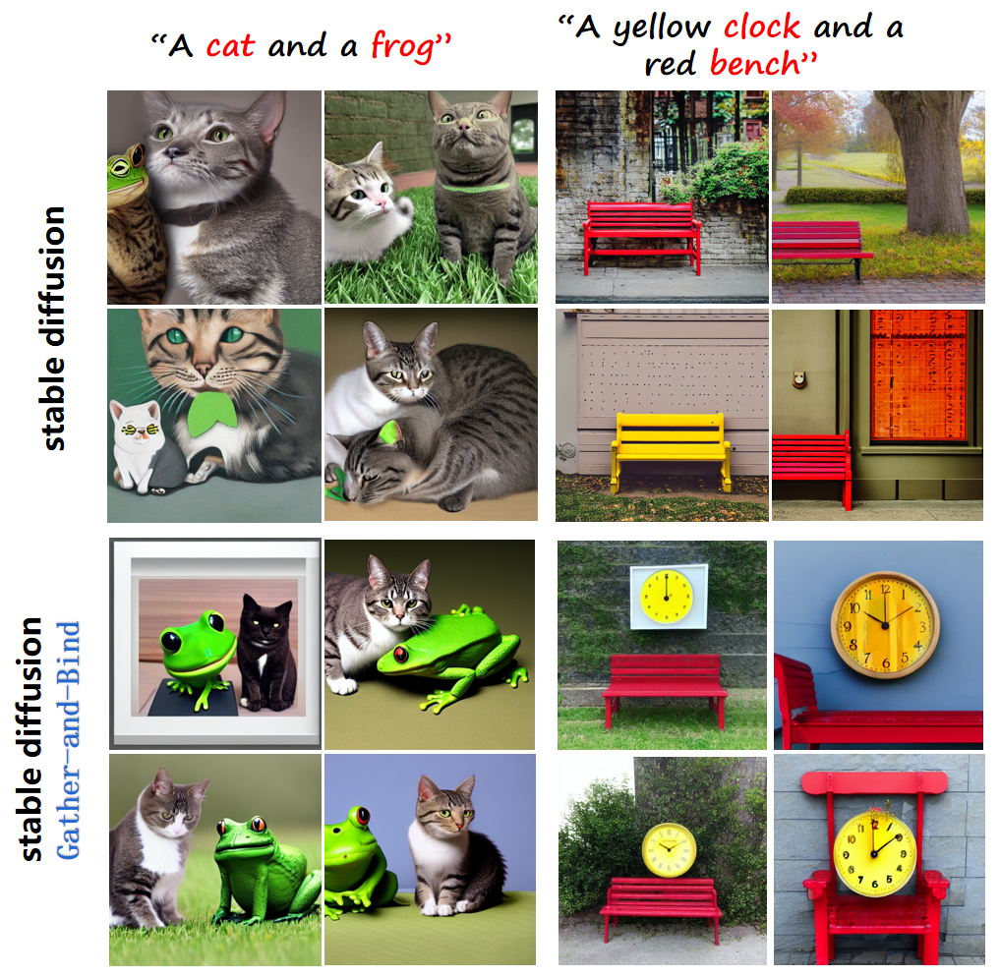
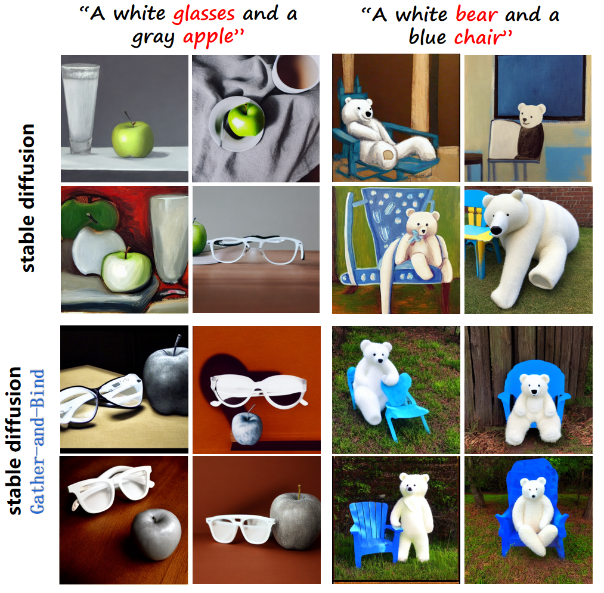
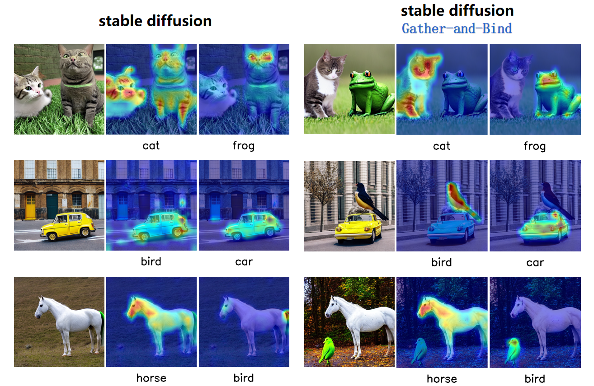

# Gather-and-Bind

## Project Introduction

Gather-and-Bind is an optimization algorithm for stable diffusion, specifically designed to enhance the quality of generated images to make them align better with the given prompts.

<div style="display: flex; justify-content: center;">
    <div style="margin-right: 20px;">
        
    </div>
    <div>
        
    </div>
</div>



## Get Start

### Installation

```bash
git clone https://github.com/huan085128/Gather-and-Bind
pip install -r requirements.txt

# Install en_core_web_trf
python -m spacy download en_core_web_trf
```

### Usage

```bash
python generate_images.py --prompt "a turtle and a yellow bowl" --seed 2000 --output_directory "./output" --model_path '/home/models/stable_diffusion_v1.5' --val_output_path './val_output'
```

### Explain
If you want to see the changes in the attention map during the inference process, please go to explain.ipynb and run the code cell.
