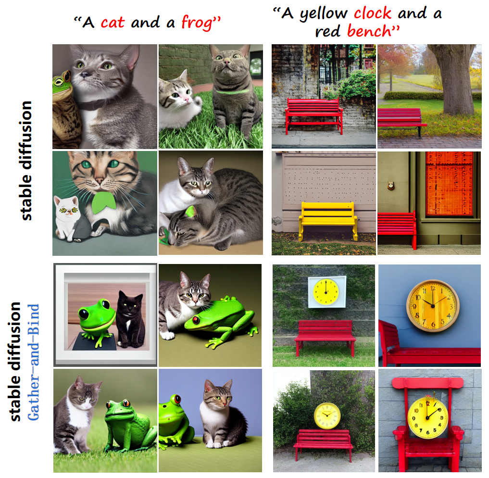
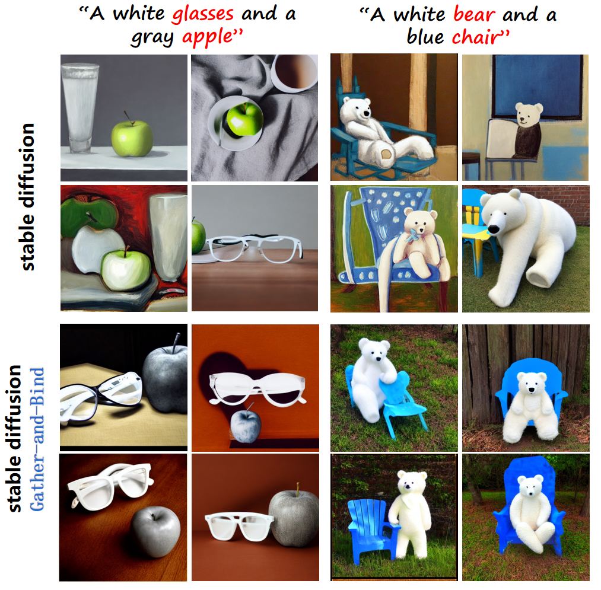
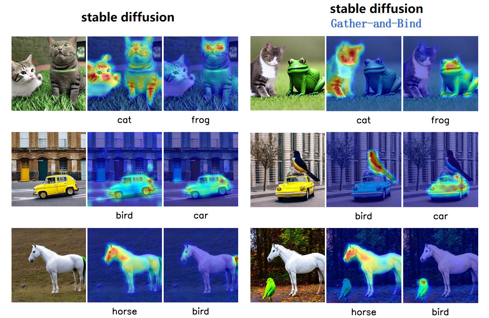

# Gather-and-Bind

## Project Introduction

Gather-and-Bind is an optimization algorithm for stable diffusion, specifically designed to enhance the quality of generated images to make them align better with the given prompts.

    

        
    

    

        
    

