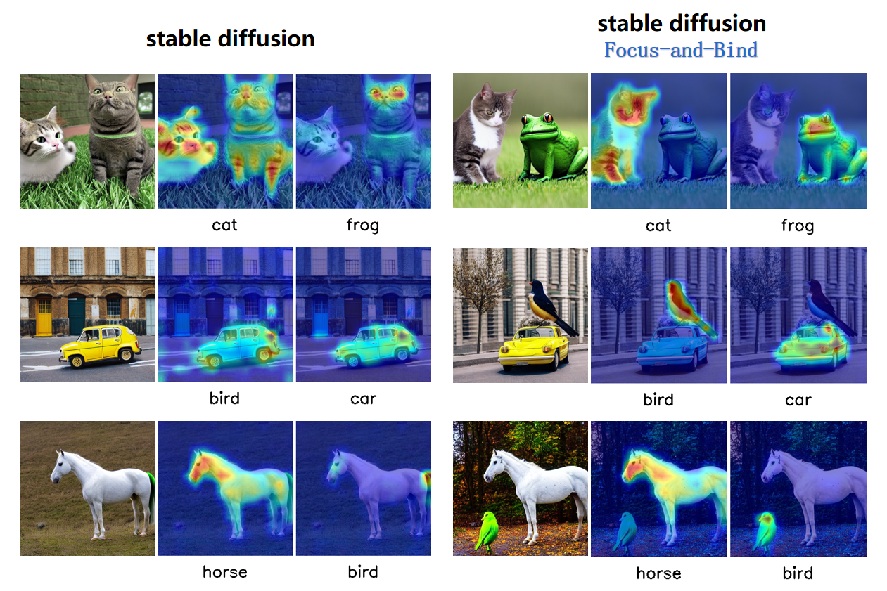

# Gather-and-Bind

## Project Introduction

Gather-and-Bind is an optimization algorithm for stable diffusion, specifically designed to enhance the quality of generated images to make them align better with the given prompts.

<div style="display: flex; justify-content: center;">
    <div style="margin-right: 20px;">
        
    </div>
    <div>
        
    </div>
</div>



## Get Start

### Step-1 installation

```bash
# clone the repository
git clone https://github.com/huan085128/Gather-and-Bind

# install environment
./install.sh
```
### Step-2 download pretrained model
Download the stable_diffusion_v1.5 model from [here](https://drive.google.com/drive/folders/1A_66w8pqR9JnZxpy4Pz1Eyuh1IH4I4Zu?usp=sharing)

and then put the model in the models directory.

### Step-3 generate images

```bash
# run the following command to generate images
python generate_images.py
```

### Step-4 visualizing attention maps with jupyter notebook

As part of the experiments in our paper, we provide a Jupyter Notebook that visualizes the changes in attention maps during the denoising process of the diffusion model. This notebook allows for a more intuitive understanding of how the model focuses on different parts. 

please see the `explain.ipynb` file for more details.
